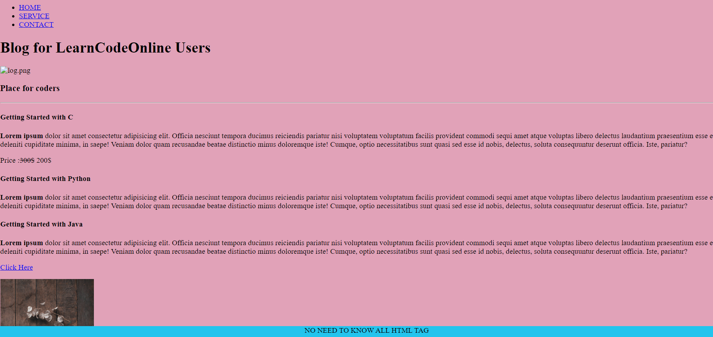
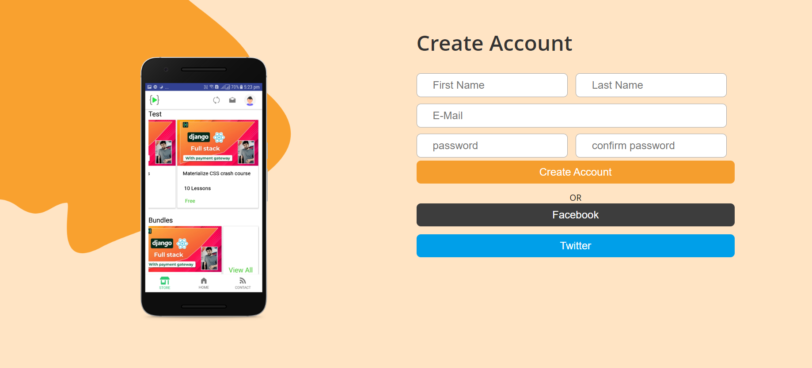
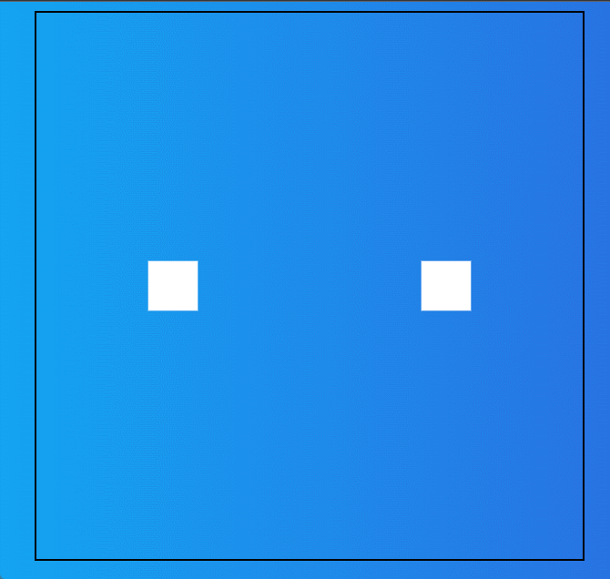
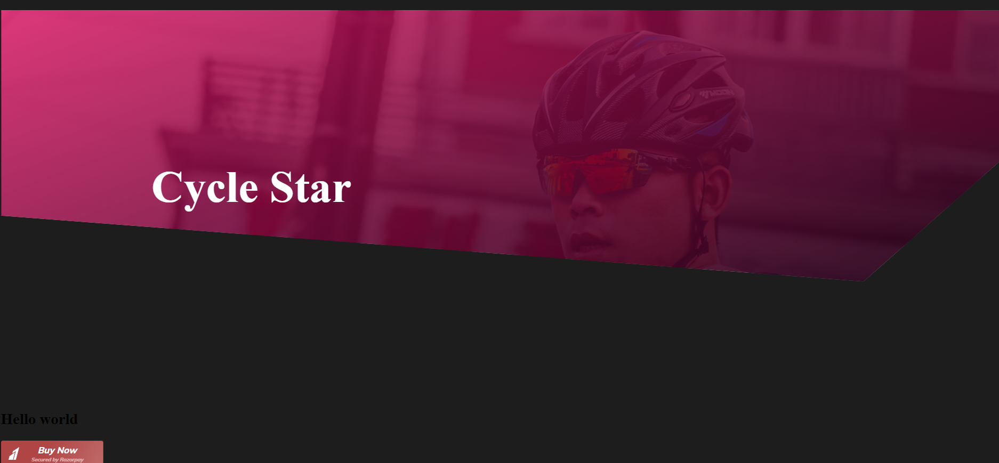

# 01 Emmet
[getting started with emmet](./01emmet/Readme.md)
- Learned emmet shortcuts

# 02 HTML
`` Created simple html file for practice
``
-  Learned about different css selectors
- Learned about different HTML Tags

# 03 Landing page
``
First Responsive Landing page created
``
- Learned about External Css
- Learned more css selectors and css properties
- Learned about Media Queries and small screen Designs
- Learned simple Transition 
# 04 Comming soon Banner
`` simple banner page created
``
- Learned About Custom Properties About css
# 05  MobileApp
`` Simple Home page Designed``
- Learned how to build a Home page
- Learned how to build navigation-bar and hero-section
- Learned About Flexbox and responsiveness
- Learned About Positioning

# 06 Registration
``Simple Registrion Form Designed``
- Learned how to build Responsive hero-section
- Learned different form inputs and input attribute
- Learned grid property in css

# 07 Animation
- Learned about Animation properties

# 08 razorpaystyle
-Learned about Razorpay pay button integration
-Learned about clip-path property which allows to make complex shapes.
[clippy](https://bennettfeely.com/clippy/)

<table border>
        <tr>
            <th>Name</th>
            <th>Thumbnail</th>
            <th>Source code</th>
            <th>Live Link</th>
        </tr>
        <tr>
            <td>02HTML</td>
            <td>
                
            </td>
            <td>
                <a href="https://github.com/Nagananda1999/HTML-CSS-LCO/tree/master/02html" target="_blank">Source</a>
            </td>
            <td>
                <a href="./02html/index.html" target="_blank">Link</a>
            </td>
        </tr>
        <tr>
            <td>03Landing page</td>
            <td>
                
            </td>
            <td>
                <a href="https://github.com/Nagananda1999/HTML-CSS-LCO/tree/master/03landing%20page" target="_blank">Source</a>
            </td>
            <td>
                <a href="./03landing page/index.html" target="_blank">Link</a>
            </td>
        </tr>
        <tr>
            <td>04 Comming Soon</td>
            <td>
                
            </td>
            <td>
                <a href="https://github.com/Nagananda1999/HTML-CSS-LCO/tree/master/04coming%20soon" target="_blank">Source</a>
            </td>
            <td>
                <a href="./04coming soon/index.html" target="_blank">Link</a>
            </td>
        </tr>
        <tr>
            <td>05 Mobile App</td>
            <td>
                
            </td>
            <td>
                <a href="https://github.com/Nagananda1999/HTML-CSS-LCO/tree/master/05app" target="_blank">Source</a>
            </td>
            <td>
                <a href="./05app/index.html" target="_blank" >Link</a>
            </td>
        </tr>
        <tr>
            <td>06 Registration</td>
            <td>
                
            </td>
            <td>
                <a href="https://github.com/Nagananda1999/HTML-CSS-LCO/tree/master/06Registration" target="_blank">Source</a>
            </td>
            <td>
                <a href="./06Registration/index.html" target="_blank">Link</a>
            </td>
        </tr>
        <tr>
            <td>07 Animation</td>
            <td>
                
            </td>
            <td>
                <a href="https://github.com/Nagananda1999/HTML-CSS-LCO/tree/master/07animation" target="_blank">Source</a>
            </td>
            <td>
                <a href="./07animation/index.html" target="_blank">Link</a>
            </td>
        </tr>
        <tr>
            <td>08 razorpaystyle</td>
            <td>
                
            </td>
            <td>
                <a href="https://github.com/Nagananda1999/HTML-CSS-LCO/tree/master/08razorpaystyle" target="_blank">Source</a>
            </td>
            <td>
                <a href="./08razorpaystyle/index.html" target="_blank">Link</a>
            </td>
        </tr>
    </table>